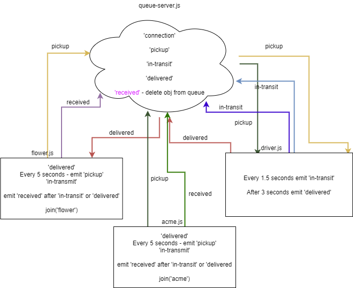

# Queue SocketIO server

### Author: Mark Duenas

[Test Reports](https://github.com/MarkDuenas/queue-server/actions)

[Pull Req](https://github.com/MarkDuenas/queue-server/pull/2)

## Set up

Node.js installed

### Running the app

- npm i (bring in dependencies)
  - socket.io
  - socket.io-client
  - jest
  - uuid
- npm start

### Tests

- Server Tests: `npm run test`

### UML

